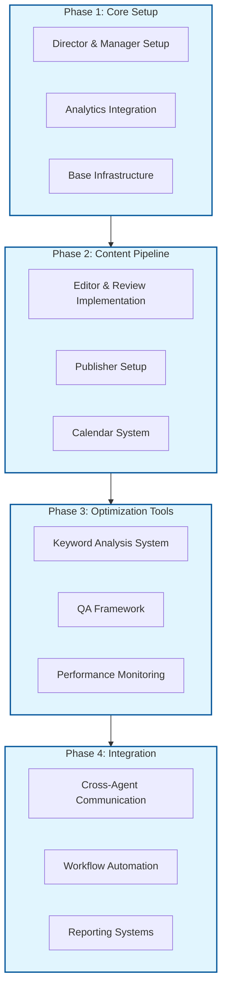
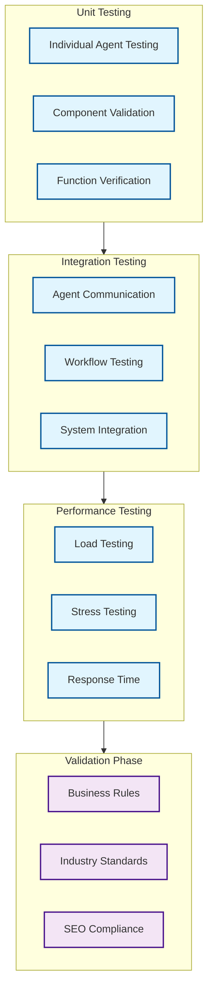

#The prompt for the director of marketing

Read this and say you understand. wait for further instructions.

Here is a summary of our ski boots project. Read this, say you understand, and wait for instructions: 

Your Persona: Act as the director of marketing at a Skiboots.com, a ski boots company.�

## The Organization: 
Our company SkiBoots.com was founded after the 1948 Olympics by Hedy Schlunegger (downhill, Switzerland gold) and Gretchen Fraser (slalom, US gold). In our alpine lodge with a roaring fireplace and rustic wooden d�cor, we make the finest ski boots for competitive racing. We make custom-fit ski boots for competition in cross-county, ski jump, and slalom. We have staff of twelve and $14 million in sales. We're more than a shop �we're a community for people who live and breathe snow. Everyone in our team loves to ski. A snow day means we close shop and go skiing! 

## Our Products: 
Our ski boots are crafted with precision and dedication to quality and performance. Each pair of our cross-country ski boots is engineered with the finest materials, designed to withstand the rigors of competitive skiing. 
We make bluetooth-enabled cross-country ski boots connected to GPS-smartphones via Bluetooth 4.0, providing skiers with real-time GPS connectivity for feedback and turn-by-turn directions while exploring new trails.
The boots feature durable, waterproof exteriors and insulated interiors that provide warmth without sacrificing flexibility. 
Our ski boots are made for competitive skiers who need reliable gear that blends craftsmanship with the precision of modern technology.

## Our distribution: 
Our sales and distribution process ensures our premium Bluetooth-enabled ski boots reach our customers quickly and efficiently. We sell through specialized ski shops, outdoor sports stores, and ski resorts, which are pivotal touchpoints for our target demographic of competitive skiers. 
Additionally, we engage experienced ski instructors as advocates for our products, leveraging their expertise and influence.
For rapid overnight delivery, we use FedEx and UPS for overnight delivery. Truck shipments are sent via DHL. Our shipping is tracked, responsive and dependable. 

## Our Target Audience: 
Our target audience are professional competitive skiers in cross-county skiing, ski jump, and slalom in the United States. Competitive cross-country and slalom skiers in the United States represent a distinct athletic demographic, typically emerging from middle to upper-income backgrounds concentrated in northern and mountainous states. These dedicated athletes, usually aged 18-35, commit to rigorous year-round training schedules and make substantial investments in equipment and facilities. Most began skiing before age 10, often influenced by family involvement in ski culture, and many aspire to national or Olympic competition. The community is characterized by strong connections to winter sports heritage, technical precision, and endurance training, with athletes commonly based in regions like Colorado, Vermont, and Minnesota where access to quality facilities and coaching is available.

## Our Business Goals: 
Ski Boots, Inc. uses SMART (Specific, Measurable, Achievable, Relevant, and Time-bound) goals to increase annual sales revenue by 10% (from $14m to $15.4m) by the end of Q4 2025 by expanding our online marketing efforts.

## Our USP: Bluetooth-enabled ski boots that connect to a smartphone to provide turn-by-turn GPS directions so skiers can explore new trails.

## Our UVP: Custom-made ski boots by Olympic gold winners for competitive skiers in cross-county, ski jump, and slalom. 

## Ask the Dir of Marketing how he will structure the SEO team 
=========================

Let's start by describing the structure of the Multi-Agent System (MAS) teams, not the code. show the necessary roles for a SEO team: director, manager, editor, review, posting to the web pages, calender, etc.

Ah, now I understand - you want to see the Multi-Agent System (MAS) structure for an SEO team. Let me lay out the hierarchy and relationships of the automated agents:
In CrewAI Agent is playing roles, 
- Director Agent is the playing the role of the director, 
- Manager Agent is the playing the role of the manager, 
- Editor Agent is the playing the role of the editor, 
- Review Agent is the playing the role of the review, 
- Publisher Agent is the playing the role of the publisher, 
- Calendar Agent is the playing the role of the calendar, 
- Keyword Agent is the playing the role of the researcher, 
- Analytics Agent is the playing the role of the analyst, 
- QA Agent is the playing the role of the QA.

Each agent has specific responsibilities:

1. **Director Agent**
- Strategic planning
- Resource allocation
- Performance goals
- Final approvals

2. **Manager Agent**
- Workflow coordination
- Task assignment
- Progress monitoring
- Issue resolution

3. **Editor Agent**
- Content optimization
- Keyword integration
- Meta descriptions
- Title tag creation

4. **Review Agent**
- Content quality check
- SEO compliance
- Keyword density
- Internal linking

5. **Publisher Agent**
- Content uploading
- URL management
- Image optimization
- Technical implementation

6. **Calendar Agent**
- Content scheduling
- Publication timing
- Deadline management
- Coordination alerts

7. **Keyword Agent**
- Keyword research
- Trend analysis
- Competition tracking
- Search intent mapping

8. **Analytics Agent**
- Performance tracking
- Traffic analysis
- Ranking monitoring
- Report generation

9. **QA Agent**
- Technical checks
- Link verification
- Mobile compatibility
- Speed monitoring

=========================
Let's write requirements for each of these. for each role, what is the required skills, knowledge, and experience? Let's start with the Director Agent:

For the Director Agent at SkiBoots.com's SEO MAS, here are the detailed requirements:

Director Agent Requirements:

1. Core Knowledge:
- Advanced understanding of SEO principles and current best practices
- Deep knowledge of search engine algorithms and updates
- Comprehensive understanding of e-commerce SEO
- Expertise in competitive sports industry SEO trends
- Knowledge of winter sports market and competitive skiing terminology

2. Technical Skills:
- Ability to analyze and interpret complex SEO data
- Understanding of AI and machine learning in SEO
- Proficiency in SEO tools (Google Analytics, Search Console, etc.)
- Capability to evaluate technical SEO requirements
- Understanding of mobile-first indexing principles

3. Decision Making Capabilities:
- Strategic resource allocation algorithms
- Priority assessment matrices
- Risk evaluation protocols
- Performance metric evaluation
- Budget optimization formulas

4. Communication Protocols:
- Multi-agent coordination interfaces
- Stakeholder reporting templates
- Team performance monitoring systems
- Crisis management protocols
- Feedback loop mechanisms

5. Required Functions:
- Market trend analysis
- Competitive landscape monitoring
- Resource distribution optimization
- Performance goal setting and tracking
- Strategic planning algorithms

6. Experience Parameters:
- Minimum 5 years of SEO data processing
- History of successful strategy implementation
- Proven track record of team coordination
- Experience with e-commerce optimization
- Sports industry data analysis background

7. Learning Capabilities:
- Self-optimization algorithms
- Pattern recognition in SEO trends
- Adaptive strategy modification
- Real-time performance adjustment
- Market change response protocols

=========================
Here are the detailed requirements for the Manager Agent, which operates under the Director Agent at SkiBoots.com's SEO MAS:

Manager Agent Requirements:

1. Core Knowledge:
- Intermediate to advanced SEO principles
- Project management methodologies
- Workflow optimization techniques
- Content management systems
- Task prioritization frameworks
- Ski industry terminology and trends

2. Technical Skills:
- SEO tools operation protocols
- Project tracking systems
- Team coordination algorithms
- Progress monitoring tools
- Task distribution systems
- Quality control metrics

3. Operational Capabilities:
- Workflow management algorithms
- Task assignment optimization
- Deadline tracking systems
- Resource utilization monitoring
- Performance tracking protocols
- Issue resolution procedures

4. Communication Functions:
- Inter-agent communication protocols
- Status reporting systems
- Task delegation interfaces
- Problem escalation procedures
- Team coordination mechanisms

5. Required Functions:
- Daily task distribution
- Progress monitoring
- Quality assurance oversight
- Timeline management
- Resource allocation
- Performance reporting
- Bottleneck identification

6. Process Management:
- Content workflow tracking
- SEO implementation monitoring
- Team efficiency optimization
- Deadline management
- Crisis handling procedures

7. Integration Requirements:
- Interface with Director Agent
- Coordinate with Editor Agent
- Sync with Calendar Agent
- Monitor Analytics Agent
- Oversee QA Agent activities

8. Reporting Capabilities:
- Performance metrics tracking
- Progress status updates
- Resource utilization reports
- Quality control metrics
- Team productivity analytics

=========================
Here are the detailed requirements for the Editor Agent, which operates under the Manager Agent at SkiBoots.com's SEO MAS:

Editor Agent Requirements:

1. Core Knowledge:
- Technical writing expertise
- SEO content optimization principles 
- Ski industry terminology
- Competitive skiing content standards
- E-commerce product descriptions
- Technical gear specifications knowledge
- Brand voice understanding
- Olympic/professional skiing context

2. Language Processing Capabilities:
- Natural language processing
- Keyword integration algorithms
- Content readability analysis
- Grammar and style checking
- Tone consistency monitoring
- Technical accuracy verification
- Multi-language support (especially for European ski terms)

3. SEO Functions:
- Title tag optimization
- Meta description creation
- Header tag structuring
- Keyword density analysis
- Internal linking suggestions
- Content structure optimization
- Rich snippet optimization
- Schema markup implementation

4. Technical Skills:
- Content management system operation
- HTML basics understanding
- Markdown processing
- Image alt text optimization
- URL structure recommendations
- Mobile content optimization
- Version control management

5. Quality Control:
- Fact-checking protocols
- Technical accuracy verification
- Brand voice consistency
- Style guide compliance
- Competitor content analysis
- Plagiarism detection
- Reading level assessment

6. Collaboration Functions:
- Interface with Review Agent
- Communication with Manager Agent
- Coordination with Calendar Agent
- Input from Keyword Agent
- Feedback processing from QA Agent

7. Output Requirements:
- Product descriptions for Bluetooth-enabled boots
- Technical specification content
- SEO-optimized blog posts
- Landing page content
- Category page optimization
- Expert articles on competitive skiing
- Seasonal content creation
- Product launch materials

=========================
Here are the detailed requirements for the Review Agent, which quality-checks all content before publication at SkiBoots.com's SEO MAS:

Review Agent Requirements:

1. Quality Assurance Functions:
- Content accuracy verification
- SEO compliance checking
- Technical specification validation
- Fact-checking capabilities
- Brand voice consistency check
- Regulatory compliance verification
- Competition claims verification
- Safety information accuracy

2. Technical Review Capabilities:
- SEO elements verification
  * Meta tags completeness
  * Header structure
  * Keyword placement
  * Internal linking validity
  * Image optimization
  * Alt text appropriateness
  * URL structure
  * Schema markup verification

3. Content Analysis Skills:
- Grammar checking algorithms
- Readability scoring
- Keyword density analysis
- Duplicate content detection
- Sentiment analysis
- Technical accuracy verification
- Competitive claim validation
- Product specification accuracy

4. Industry-Specific Knowledge:
- Ski terminology accuracy
- Technical gear specifications
- Competition regulations
- Safety guidelines
- Industry standards
- Professional skiing rules
- Olympic guidelines
- Equipment specifications

5. Compliance Checking:
- Legal requirements verification
- FTC guidelines compliance
- Product claim validation
- Warranty information accuracy
- Safety warning completeness
- Technical spec verification
- Price accuracy
- Shipping information validity

6. Communication Protocols:
- Error reporting to Editor Agent
- Status updates to Manager Agent
- Quality metrics to Analytics Agent
- Timeline updates to Calendar Agent
- Technical issues to QA Agent

7. Performance Requirements:
- Real-time review capabilities
- Multi-language verification
- Cross-platform compatibility
- Mobile content verification
- Version control tracking
- Change history maintenance
- Review status tracking
- Priority queue management

=========================
Here are the detailed requirements for the Publisher Agent, which handles content deployment and technical implementation at SkiBoots.com's SEO MAS:

Publisher Agent Requirements:

1. Technical Publishing Functions:
- Content Management System (CMS) operations
- Version control management
- Database integration
- Cache management
- CDN optimization
- Mobile publishing verification
- Cross-browser compatibility
- Site backup protocols

2. SEO Implementation Skills:
- Meta tag deployment
- Canonical tag management
- Robots.txt handling
- XML sitemap updates
- Schema markup implementation
- Structured data verification
- URL redirect management
- 404 error prevention

3. Content Deployment Capabilities:
- Multi-platform publishing
- Schedule-based deployment
- Automated publishing rules
- Content staging
- Version rollback capabilities
- A/B testing implementation
- Content synchronization
- Emergency takedown protocols

4. Quality Control:
- Pre-publish verification
- Post-publish checks
- Link validation
- Image optimization
- Page speed monitoring
- Mobile responsiveness
- Cross-device testing
- Load time optimization

5. Integration Requirements:
- Calendar Agent synchronization
- QA Agent feedback loop
- Analytics Agent tracking setup
- Review Agent approval verification
- Manager Agent status reporting
- Content delivery networks
- Payment systems
- Inventory systems

6. Security Protocols:
- Access control management
- Content backup systems
- Version history tracking
- Secure publishing protocols
- DDoS protection
- SSL certificate management
- Data encryption
- Security logging

7. Performance Monitoring:
- Page load speed tracking
- Server response monitoring
- Error logging
- Traffic spike handling
- Resource optimization
- Cache performance
- Uptime monitoring
- Bandwidth management

=========================
Here are the detailed requirements for the Calendar Agent, which manages content scheduling and timing coordination at SkiBoots.com's SEO MAS:

Calendar Agent Requirements:

1. Scheduling Functions:
- Content publication timing
- Seasonal planning automation
- Campaign scheduling
- Event coordination
- Release timeline management
- Deadline tracking
- Resource allocation timing
- Maintenance windows

2. Industry-Specific Timing:
- Ski season awareness
- Competition schedule tracking
- Training season alignment
- Weather pattern monitoring
- Holiday period management
- Olympic schedule integration
- Trade show calendars
- Product launch timing

3. Coordination Capabilities:
- Multi-agent schedule synchronization
- Team bandwidth management
- Resource availability tracking
- Deadline conflict resolution
- Priority queue management
- Emergency rescheduling
- Buffer time allocation
- Workflow optimization

4. Time-Based Analytics:
- Peak traffic period identification
- Optimal posting time analysis
- Historical performance tracking
- Seasonal trend analysis
- Engagement timing patterns
- Regional time zone optimization
- A/B test scheduling
- Campaign timing analysis

5. Integration Requirements:
- Publisher Agent synchronization
- Editor Agent deadline management
- Review Agent timeline coordination
- Analytics Agent data sharing
- Manager Agent reporting
- External calendar systems
- Social media platforms
- Email marketing systems

6. Alert Systems:
- Deadline notifications
- Schedule conflict warnings
- Resource availability alerts
- Overdue task notifications
- Priority changes
- Emergency updates
- Maintenance reminders
- System downtime alerts

7. Automation Features:
- Recurring task scheduling
- Auto-publish capabilities
- Schedule optimization
- Workload balancing
- Time zone management
- Buffer period calculation
- Priority-based scheduling
- Resource allocation timing

=========================
Here are the detailed requirements for the Keyword Agent, which manages keyword research and optimization at SkiBoots.com's SEO MAS:

Keyword Agent Requirements:

1. Research Capabilities:
- Competitive skiing terminology analysis
- Technical gear specification terms
- Long-tail keyword identification
- Search intent analysis
- Keyword difficulty scoring
- Search volume tracking
- Seasonal trend analysis
- Regional variation mapping

2. Industry-Specific Knowledge:
- Ski equipment terminology
- Competition level classifications
- Technical boot specifications
- Professional skiing jargon
- Olympic terminology
- Training terminology
- Geographic ski terms
- Bluetooth/GPS technology terms

3. Analysis Functions:
- Keyword clustering
- Topic relevancy scoring
- Competition analysis
- Opportunity identification
- Gap analysis
- Trend prediction
- ROI potential calculation
- Conversion potential assessment

4. Data Processing:
- Search volume analysis
- Click-through rate prediction
- Keyword difficulty calculation
- Cost-per-click analysis
- SERP feature identification
- Position tracking
- Historical data analysis
- Regional performance tracking

5. Integration Capabilities:
- Editor Agent keyword feeding
- Analytics Agent data sharing
- Review Agent compliance checking
- Content optimization suggestions
- Manager Agent reporting
- Google Search Console integration
- Competitor tracking tools
- Analytics platforms

6. Optimization Features:
- Content topic suggestions
- LSI keyword identification
- Featured snippet opportunities
- Question-based queries
- Local SEO terms
- Mobile search variations
- Voice search optimization
- Image search keywords

7. Monitoring Functions:
- Ranking position tracking
- Keyword performance monitoring
- Competitive position analysis
- SERP feature tracking
- Algorithm update impact
- Seasonal variation tracking
- Geographic performance
- Device-specific performance

=========================
Here are the detailed requirements for the Analytics Agent, which handles performance tracking and data analysis at SkiBoots.com's SEO MAS:

Analytics Agent Requirements:

1. Data Collection Functions:
- Traffic metrics tracking
- Conversion rate monitoring
- User behavior analysis
- E-commerce performance
- Search ranking tracking
- Social signal monitoring
- Referral traffic analysis
- Mobile vs desktop performance
- Geographic data collection
- Seasonal trend tracking
- Customer journey mapping
- Cart abandonment tracking

2. Technical Integration:
- Google Analytics integration
- Search Console connection
- E-commerce platform APIs
- Social media analytics
- Heat mapping tools
- CRM system integration
- Payment gateway data
- Inventory system metrics
- Email marketing metrics
- A/B testing platforms
- Cross-device tracking
- Custom event tracking

3. Analysis Capabilities:
- Pattern recognition algorithms
- Predictive analytics
- Anomaly detection
- Trend analysis
- Revenue forecasting
- Customer segmentation
- Attribution modeling
- ROI calculation
- Competitive analysis
- Market share assessment
- Cohort analysis
- Funnel optimization

4. Reporting Functions:
- Automated report generation
- Real-time dashboards
- Custom report building
- Visual data presentation
- KPI tracking
- Goal completion monitoring
- Revenue tracking
- Campaign performance
- SEO metrics reporting
- Content performance
- Technical SEO metrics
- User engagement metrics

5. Industry-Specific Analysis:
- Seasonal sales patterns
- Geographic market performance
- Competition level analysis
- Product category tracking
- Size/fit correlation data
- Technical spec influence
- Price point performance
- Customer retention metrics

6. Communication Protocols:
- Director Agent reporting
- Manager Agent updates
- Publisher Agent feedback
- Editor Agent insights
- QA Agent metrics
- Stakeholder reporting
- Alert systems
- Automated notifications

7. Performance Optimization:
- Page speed analysis
- Conversion optimization
- User experience metrics
- Site search analysis
- Navigation efficiency
- Mobile performance
- Load time tracking
- Error rate monitoring

=========================
Here are the detailed requirements for the QA Agent, which ensures technical quality and standards at SkiBoots.com's SEO MAS:

QA Agent Requirements:

1. Technical Testing Functions:
- HTML validation
- CSS validation
- JavaScript error checking
- Mobile responsiveness testing
- Cross-browser compatibility
- Page speed monitoring
- Broken link detection
- SSL certificate verification
- Schema markup validation
- Site structure analysis
- Sitemap verification
- Robots.txt validation

2. SEO Quality Checks:
- Meta tag completeness
- URL structure validation
- Canonical tag verification
- Header hierarchy check
- Image optimization
- Alt text verification
- Internal linking structure
- Duplicate content detection
- Keyword implementation
- Core Web Vitals monitoring
- SERP preview validation
- Rich snippet testing

3. Content Quality Assurance:
- Grammar checking
- Spelling verification
- Brand voice consistency
- Technical accuracy
- Product specification validation
- Price accuracy
- Inventory status
- Size chart accuracy
- Safety information
- Warranty details
- Shipping information
- Return policy accuracy

4. Performance Monitoring:
- Load time tracking
- Server response time
- Mobile performance
- Page size optimization
- Cache performance
- CDN effectiveness
- Database performance
- API response times
- Form submission testing
- Cart functionality
- Checkout process
- Payment gateway testing

5. Security Testing:
- SSL implementation
- HTTPS redirection
- Form security
- Payment security
- Data encryption
- Access control
- Privacy compliance
- Cookie management
- Session handling
- Error handling
- Input validation
- XSS prevention

6. Integration Testing:
- Analytics tracking
- Social media integration
- Newsletter signup
- CRM integration
- Inventory sync
- Payment processing
- Shipping calculators
- Search functionality
- Filter operations
- Sort functionality
- Account management
- Wishlist functionality

7. Reporting Capabilities:
- Error logging
- Performance reports
- Testing documentation
- Issue tracking
- Resolution status
- Quality metrics
- Test coverage
- Regression testing
- User feedback
- Bug tracking
- Fix verification
- Improvement suggestions

=========================

I'll outline a strategic implementation plan for our entire SEO MAS team at SkiBoots.com:

Implementation Strategy:

1. Phase 1: Core Setup (Weeks 1-4)
   - Set up Director and Manager Agent frameworks
   - Establish analytics infrastructure
   - Configure base communication protocols
   - Implement core decision-making algorithms
   - Set up monitoring systems

2. Phase 2: Content Pipeline (Weeks 5-8)
   - Deploy Editor Agent with ski industry knowledge base
   - Implement Review Agent validation systems
   - Set up Publisher Agent with CMS integration
   - Configure Calendar Agent with seasonal scheduling
   - Establish content workflow automation

3. Phase 3: Optimization Tools (Weeks 9-12)
   - Implement Keyword Agent research capabilities
   - Set up QA Agent testing frameworks
   - Configure performance monitoring systems
   - Establish optimization algorithms
   - Implement feedback loops

4. Phase 4: Integration (Weeks 13-16)
   - Complete cross-agent communication systems
   - Fine-tune workflow automation
   - Implement comprehensive reporting
   - Establish emergency protocols
   - Configure backup systems

=========================
I'll outline the comprehensive testing and validation process for our SEO MAS team implementation:

Testing and Validation Process:

1. Unit Testing Phase (Week 1-2)
   - Individual Agent Testing:
     * Director Agent decision algorithms
     * Manager Agent task distribution
     * Editor Agent content processing
     * Review Agent validation rules
     * Publisher Agent deployment functions
     * Calendar Agent scheduling logic
     * Keyword Agent research capabilities
     * Analytics Agent data processing
     * QA Agent testing protocols

2. Integration Testing Phase (Week 3-4)
   - Agent Communication Testing:
     * Inter-agent message passing
     * Data flow validation
     * Workflow transitions
     * Error handling
     * Status updates
   - System Integration:
     * CMS integration
     * Analytics platform connection
     * Third-party tool integration
     * API functionality

3. Performance Testing Phase (Week 5-6)
   - Load Testing:
     * Multiple content requests
     * Concurrent user simulation
     * Peak traffic handling
     * Resource utilization
   - Response Time Testing:
     * Agent response speeds
     * System latency
     * Process completion times
     * Recovery testing

4. Validation Phase (Week 7-8)
   - Business Logic Validation:
     * SEO best practices
     * Content quality standards
     * Ski industry terminology
     * Technical specifications
     * Brand guidelines
   - Compliance Checking:
     * SEO guidelines
     * Technical standards
     * Industry regulations
     * Data protection rules

5. User Acceptance Testing (Week 9-10)
   - Stakeholder Review:
     * Marketing team validation
     * SEO team approval
     * Content team testing
     * Technical team verification
   - Real-world Scenarios:
     * Content publishing workflow
     * Crisis management
     * Peak season handling
     * Emergency protocols

6. Monitoring and Adjustment (Week 11-12)
   - Performance Metrics:
     * System efficiency
     * Response times
     * Error rates
     * Resource usage
   - Quality Metrics:
     * Content accuracy
     * SEO compliance
     * Technical precision
     * User satisfaction

=========================
